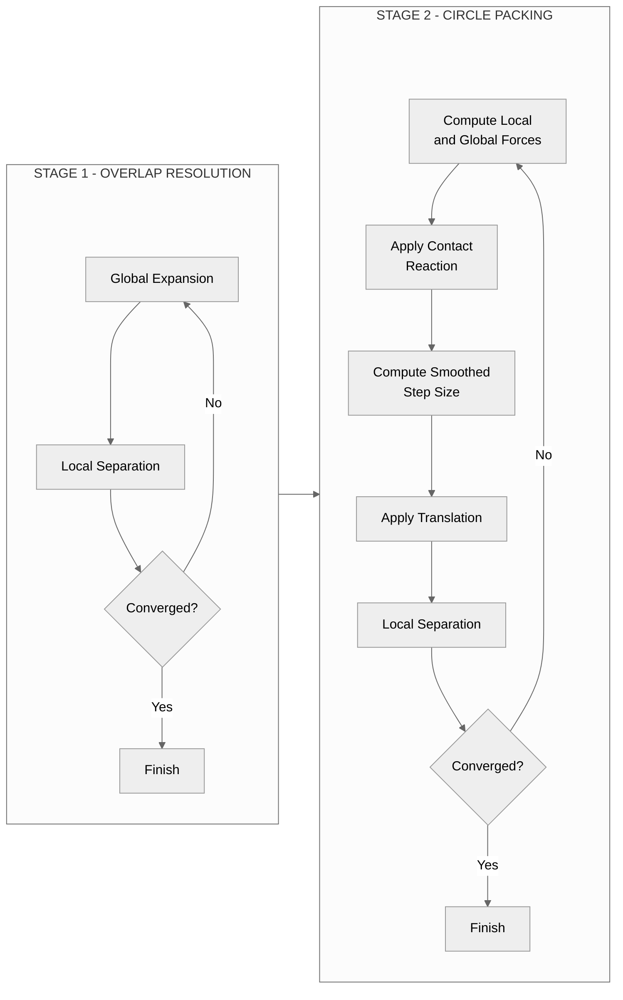

# Circle Packing Layout Algorithm

## Overview

The circle packing layout (`CirclePackingLayout`, string key `"topology"`) uses a two-stage force-based simulator — `TopologyPreservingSimulator` — to place proportionally-sized circles while preserving the topological relationships between neighboring regions. The simulator uses position-based dynamics with explicit contact reaction constraints, enabling circles to slide along each other at contact points.

Source: [layouts/packing/\_\_init\_\_.py](https://github.com/bright-fakl/carto-flow/blob/main/src/carto_flow/symbol_cartogram/layouts/packing/__init__.py) (`CirclePackingLayout`), [layouts/packing/\_simulator.py](https://github.com/bright-fakl/carto-flow/blob/main/src/carto_flow/symbol_cartogram/layouts/packing/_simulator.py) (`TopologyPreservingSimulator`)

## Algorithm Architecture

### Two-Stage Design

The algorithm operates in two sequential stages: **Stage 1 (Overlap Resolution)** achieves a valid non-overlapping configuration through iterative global expansion and local separation, while **Stage 2 (Circle Packing)** optimizes positions using local and global forces with contact reaction constraints and smoothed step integration, iterating until convergence.



## Stage 1: Overlap Resolution

Stage 1 uses an iterative combination of global expansion (keeping relative position of circles intact) and local separation (especially effective for circles with large overlaps) to reach a configuration of non-overlapping circles.

### Global Expansion

For any pair of circles, if the actual distance between their centers, $d_{ij}$, is smaller than their touching distance (i.e., the sum of the radii $r_i$ and $r_j$, and any desired spacing $\sigma$), then the circles overlap. The ratio between the touching distance and the actual distance defines an expansion factor that when applied (keeping the radii constant, and relative to any origin, but in our case the centroid of all circles $\mathbf{C}$), separates the two circles exactly at the touching distance.

From all circle pairs, the maximum expansion factor is computed and capped at $s_{\text{max}}$. In each iteration of the overlap resolution, expansion is performed at a customizable fraction $\rho^{\text{global}}$ of the maximum capped expansion factor. Note that capping the expansion factor is needed to avoid extremely large expansion factors due to circles that (almost) completely overlap. This type of large overlap is best resolved using the local separation described below. Note that expansion is only performed when the expansion factor $s>1$. The final equation for the expansion factor $s$ is:

$$
d_{ij}=\|\mathbf{p}_i - \mathbf{p}_j\|
$$

$$
d_{ij}^{\text{touch}}=r_i + r_j + \sigma
$$

$$
s = 1 + \rho^{\text{global}}\left( \min \left( \max_{ij} \left( \frac{d_{ij}^{\text{touch}}}{d_{ij}} \right), s_{\text{max}} \right) - 1 \right)
$$

Add the positions of the circles after expansion are given by:

$$
\mathbf{p}_i^{\text{expanded}} = \mathbf{C} + s \cdot (\mathbf{p}_i - \mathbf{C})
$$


### Local Separation

Local separation of overlapping circle pairs is performed by pushing the circles apart along the line that connects their centers. For coincident circles, a random direction for separation is chosen. For each circle pair, we determine the overlap $o_{ij} = d_{ij}^{\text{touch}}-d_{ij}$ and the unit vector $\hat{\mathbf{u}}_{ij} = \frac{\mathbf{p}_j - \mathbf{p}_i}{\| \mathbf{p}_j - \mathbf{p}_i \|}$. Each circle is then moved by $\delta_{ij}=\frac{1}{2} \rho^{\text{local}} o_{ij} \cdot \hat{\mathbf{u}}_{ij}$. The new circle positions then become:

$$
\mathbf{p}_i^{\text{new}} = \mathbf{p}_i^{\text{old}} - \frac{1}{2} \rho^{\text{local}} o_{ij} \cdot \hat{\mathbf{u}}_{ij}
$$

$$
\mathbf{p}_j^{\text{new}} = \mathbf{p}_j^{\text{old}} + \frac{1}{2} \rho^{\text{local}} o_{ij} \cdot \hat{\mathbf{u}}_{ij}
$$

### Convergence

The overlap resolution stage ends when either the maximum iterations has been reached or the maximum remaining circle overlap is smaller than a tolerance level $\tau$ (defined as a fraction of the mean circle radius): $\underset{ij}\max(o_{ij})<\tau \cdot \bar{r}$.


## Stage 2: Circle Packing

In the second stage, circle positions are optimized to preserve topology as much as possible (and desired). A force-based simulator uses position-based dynamics with four attraction forces, combined with explicit contact reaction constraints and local overlap resolution.

### Force Components

The total force acting on each circle $i$ is the sum of:
- a global compaction force $\mathbf{f}_i^{\text{global}}$ that pulls circles towards the (original) centroid of all circles
- a pull force $\mathbf{f}_i^{\text{origin}}$ towards the original circle positions
- a neighbor attraction force $\mathbf{f}_i^{\text{neigh}}$ that keeps circles representing adjacent geometries together
- a topological attraction force $\mathbf{f}_i^{\text{topo}}$ that tries to maintain the relative orientation between neighboring circles according to the topology of the original geometries
- a group attraction force $\mathbf{f}_i^{\text{group}}$, present only when the layout is run with `group_by`, that pulls each circle toward the centroid of its own group

Let's define a single force vector acting on a circle as $\vec{f}=\left\langle f_{x}, f_{y} \right\rangle$ and the vector of forces acting on all $n$ circles as $\mathbf{f}=\left[\vec{f}_1,\cdots,\vec{f}_n \right]^{\top}$. We can now define a matrix that combines all three attractive forces as $\mathbf{F}=\left[ \mathbf{f}^{\text{global}}, \mathbf{f}^{\text{origin}}, \mathbf{f}^{\text{neigh}}, \mathbf{f}^{\text{topo}} \right]$. The four forces are combined through user-defined weights $\mathbf{w}=\left[ w^{\text{global}}, w^{\text{origin}}, w^{\text{neigh}}, w^{\text{topo}} \right]$ and passed through a contact reaction function $K$ that cancels or otherwise modifies compressing forces acting on touching (or overlapping) circles. For each iteration in the algorithm, the final forces acting on the circles is then: $\mathbf{f}_t = K \left( \mathbf{F_t}\mathbf{w}^{\top} \right)$.

#### 2.1 Global Compaction

Pulls circles toward the area-weighted centroid. The force direction always points toward the centroid $\mathbf{C}$:

$$
\hat{\mathbf{u}}_i = \frac{\mathbf{C} - \mathbf{p}_i}{\|\mathbf{C} - \mathbf{p}_i\|}
$$

The force magnitude depends on the `force_mode` parameter:

| Mode | Formula | Description |
|------|---------|-------------|
| `direction` | $\|\mathbf{f}\| = \min\left(1, \frac{d_i}{r_i}\right)$ | Constant magnitude with drop-off near centroid |
| `linear` | $\|\mathbf{f}\| = d_i$ | Spring-like: force proportional to distance |
| `normalized` | $\|\mathbf{f}\| = \frac{d_i}{r_i}$ | Distance normalized by circle radius |

where $d_i = \|\mathbf{C} - \mathbf{p}_i\|$ is the distance to centroid and $r_i$ is the circle radius..

The default `direction` mode provides uniform compaction without over-pulling large circles, while `linear` creates spring-like behavior and `normalized` scales force by circle size.


#### 2.2 Origin Attraction Force

Pulls each circle toward its original position. This force helps maintain the overall spatial distribution of circles while allowing packing optimization.

**Direction:**

$$
\hat{\mathbf{u}}_i = \frac{\mathbf{p}_i^0 - \mathbf{p}_i}{\|\mathbf{p}_i^0 - \mathbf{p}_i\|}
$$

where $\mathbf{p}_i^0$ is the original position of circle $i$.

**Force magnitude** (depends on `force_mode` parameter):

| Mode | Formula | Description |
|------|---------|-------------|
| `direction` | $\|\mathbf{f}\| = \min\left(1, \frac{d_i}{r_i}\right)$ | Constant magnitude with drop-off near origin |
| `linear` | $\|\mathbf{f}\| = d_i$ | Spring-like: force proportional to distance |
| `normalized` | $\|\mathbf{f}\| = \frac{d_i}{r_i}$ | Distance normalized by circle radius |

where $d_i = \|\mathbf{p}_i^0 - \mathbf{p}_i\|$ is the distance to original position.

**Usage notes:**
- Default `origin_weight = 0` disables this force
- Values 0.1-0.5 provide gentle pull toward original positions
- Values > 1.0 create strong pull that may interfere with topology preservation

#### 2.3 Neighbor Force

Pulls separated adjacent circles together. The force only acts on pairs $(i, j)$ that are marked as neighbors in the adjacency matrix and are currently separated by a positive gap.

**Definitions:**

$$
d_{\text{target}} = r_i + r_j + \sigma
$$

$$
g = d_{ij} - d_{\text{target}} = \|\mathbf{p}_j - \mathbf{p}_i\| - (r_i + r_j + \sigma)
$$

**Force formula** (active only when $g > 0$):

$$
\mathbf{F}_{ij}^{\text{neigh}} = w_{ij} \cdot \min\left(\frac{g}{d_{\text{target}}}, 1\right) \cdot \hat{\mathbf{u}}_{ij}
$$

where:
- $\hat{\mathbf{u}}_{ij} = \frac{\mathbf{p}_j - \mathbf{p}_i}{\|\mathbf{p}_j - \mathbf{p}_i\|}$ is the unit direction from $i$ to $j$
- $w_{ij}$ is the adjacency weight for the pair (allows weighted adjacency relationships)
- The strength is capped at 1.0 to prevent excessive forces for large gaps

**Behavior:**
- When circles are touching or overlapping ($g \leq 0$): no neighbor force applied
- When circles are slightly separated: gentle pull proportional to gap
- When circles are far apart: maximum strength pull (capped)


#### 2.4 Distance-Gated Angular Topology Force

Preserves the angular relationship between adjacent circles by trying to align their current direction vector with the original direction vector.

**Definitions:**

$$
\hat{\mathbf{u}}_0 = \frac{\mathbf{p}_j^0 - \mathbf{p}_i^0}{\|\mathbf{p}_j^0 - \mathbf{p}_i^0\|} \quad \text{(original unit direction)}
$$

$$
\hat{\mathbf{u}} = \frac{\mathbf{p}_j - \mathbf{p}_i}{\|\mathbf{p}_j - \mathbf{p}_i\|} \quad \text{(current unit direction)}
$$

$$
g = d_{ij} - (r_i + r_j + \sigma) \quad \text{(gap, same as neighbor force)}
$$

**Distance gate function:**

$$
w(g) = \begin{cases}
1 & \text{if } g \leq 0 \text{ (touching/overlapping)} \\
\left(1 - \frac{g}{g_{\max}}\right)^2 & \text{if } 0 < g < g_{\max} \\
0 & \text{if } g \geq g_{\max}
\end{cases}
$$

**Force formula:**

$$
\mathbf{F}_{ij}^{\text{topo}} = w_{\text{topo}} \cdot w_{ij} \cdot w(g) \cdot (\hat{\mathbf{u}}_0 - \hat{\mathbf{u}})
$$

where $w_{ij}$ is the adjacency weight for the pair.

**Behavior:**
- When circles are touching ($g \leq 0$): full force strength to restore original orientation
- When circles are separated by up to $g_{\max}$: smoothly decaying force
- When circles are far apart ($g \geq g_{\max}$): no topology force (prevents distant circles from affecting each other)

**Key insight**: The force direction $(\hat{\mathbf{u}}_0 - \hat{\mathbf{u}})$ rotates the current direction toward the original direction, preserving the angular relationship without changing the distance.


#### 2.5 Group Attraction Force

When the layout is run with `group_by`, each circle is also pulled toward the current
centroid of its own group, with strength `group_weight`. The centroid is recomputed every
step rather than taken from the original positions, so a group drifts as a unit instead of
being anchored where it started. The magnitude follows the same `force_mode` table as
global compaction, with the group centroid in place of $\mathbf{C}$. At the default
`group_weight` of 0, the force is skipped entirely and the grouping affects styling and
export but not placement.

### How the Force Weights Relate

The weights are comparable **per interaction**, but not per circle, and the difference is
what decides how a given setting behaves.

In the default `direction` mode each of the three per-circle forces - global compaction,
origin attraction and group attraction - has magnitude $w \cdot \min(1, d/r)$, so it
contributes at most its own weight to a circle in one step. The two pair forces are bounded
the same way per pair: the neighbor force is at most $w^{\text{neigh}} \cdot w_{ij}$, and
the topology force at most $2 \cdot w^{\text{topo}} \cdot w_{ij}$, because
$(\hat{\mathbf{u}}_0 - \hat{\mathbf{u}})$ is a difference of unit vectors and so reaches
length 2 when the two directions are opposed.

**Accumulation is where they part.** Compaction, origin and group attraction are applied
once per circle. The neighbor and topology forces are applied once per adjacent *pair* and
summed into both endpoints, so a circle receives as many contributions as it has neighbors.
With the default binary adjacency every pair weight $w_{ij}$ is 1, and the sum is simply the
region's neighbor count - which for a geographic input is typically around four or five, and
varies from one for a region with a single neighbor to eight or more for a well-connected
interior one. A neighbor weight is therefore effectively multiplied by each region's degree,
while a group weight is not, and two weights of equal value do not carry equal influence.

Two consequences worth keeping in mind:

- Raising `group_weight` to match `neighbor_weight` does not balance the two. To make group
  attraction weigh as much as neighbor attraction on a typical region, `group_weight` has to
  be larger by roughly the mean neighbor count.
- The amplification is a property of the adjacency values, not of the force. Under
  `adjacency_mode=WEIGHTED` or `AREA_WEIGHTED` the pair weights are fractions of a shared
  perimeter or area rather than ones, and they sum to about 1 per region, so the pair forces
  lose the degree multiplier and land back on the same scale as the per-circle ones.

**The common scale is specific to `direction` mode.** `force_mode` changes only the three
per-circle forces; the neighbor and topology forces always use the bounded form above. Under
`linear` the per-circle forces become proportional to raw distance in map units, and under
`normalized` proportional to distance in radii with no upper clip. In either mode they are no
longer bounded by their weight, so they cannot be compared against the pair forces by weight
at all.

## Contact Reaction

The contact reaction constraint allows circles to slide along each other without penetrating. This is critical for achieving tight packing. The behavior is controlled by two parameters:

- **`contact_transfer_ratio`** (0-1): Balance between canceling and transferring compressive forces
- **`contact_elasticity`** (-1 to 1): Controls net compression vs bounce behavior

### Mathematical Formulation

For circles in contact, decompose the force into normal and tangential components:

$$
\mathbf{F} = F_n \cdot \hat{\mathbf{n}} + F_t \cdot \hat{\mathbf{t}}
$$

The contact reaction applies two operations:

**1. Cancel compressive component:**

$$
\mathbf{F}_i^{\text{after}} = \mathbf{F}_i^{\text{before}} - a \cdot \max(0, F_n^i) \cdot \hat{\mathbf{n}}_{ij}
$$

**2. Transfer compressive component:**

$$
\mathbf{F}_j^{\text{after}} = \mathbf{F}_j^{\text{before}} + b \cdot \max(0, F_n^i) \cdot \hat{\mathbf{n}}_{ij}
$$

where the coefficients are computed as:

$$
s = \frac{1 - \text{elasticity}}{1 + \text{elasticity}}
$$

$$
a = (1 - \text{transfer\_ratio})^s
$$

$$
b = \text{transfer\_ratio}^s
$$

### Parameter Effects

| `transfer_ratio` | `elasticity` | Behavior |
|------------------|--------------|----------|
| 0.0 | any | Pure cancel - compressive forces dissipate |
| 1.0 | any | Pure transfer - forces pass through contacts |
| 0.5 | 0.0 | Balanced cancel/transfer |
| 0.5 | -1.0 | Compression favored (forces tend to pass through) |
| 0.5 | 1.0 | Bounce favored (forces tend to reflect) |

This allows tangential sliding while controlling how compressive forces are handled at contact points:


## Step Integration with Clamping

Each packing iteration computes forces, resolves contacts, and integrates positions with step clamping:

**Step size formula:**

$$
\Delta \mathbf{p}_i = \min\left(1, \frac{\Delta_{\max}}{\|\mathbf{F}_i\|}\right) \cdot \mathbf{F}_i \cdot r_i^{\text{eff}}
$$

where $r_i^{\text{eff}} = \bar{r} \left(\frac{r_i}{\bar{r}}\right)^{\sigma_{\text{size}}}$ is the effective radius controlled by `size_sensitivity` ($\sigma_{\text{size}}$).

**Step smoothing via EMA:**

$$
\mathbf{s}_t = \alpha \cdot \mathbf{s}_t^{\text{raw}} + (1 - \alpha) \cdot \mathbf{s}_{t-1}
$$

where $\alpha = \frac{2}{n_{\text{eff}} + 1}$ and $n_{\text{eff}}$ is the `step_smoothing_window` parameter (default: 20).

## Convergence Criteria

The simulator converges when the system reaches a steady state, detected by tracking the drift rate:

**Drift and jitter metrics:**

$$
\text{drift} = \frac{1}{|S|} \sum_{i \in S} \frac{\|\boldsymbol{\mu}_i\|}{r_i}
$$

$$
\text{jitter} = \frac{1}{|S|} \sum_{i \in S} \frac{\sigma_i}{r_i}
$$

where $\boldsymbol{\mu}_i$ and $\sigma_i$ are the EMA mean and standard deviation of the displacement vector for circle $i$, and $S = \{i : r_i > 0\}$.

Both metrics measure displacement in units of circle radius, so a circle of zero radius — produced by a zero sizing value — has no scale to measure against and is left out of the averages. When every circle has zero radius there is nothing to pack and both metrics are zero.

A zero-radius circle still takes part in the force computation. It cannot overlap and cannot be pushed apart from a neighbor, but the centroid, origin, and group attraction forces still act on it. In `direction` mode their magnitudes $\min(1, d_i / r_i)$ are at their maximum for such a circle, since any positive distance is infinitely many radii.

**Convergence condition:**

$$
\text{EMA}(\text{drift_rate} < 0) < 0.5
$$


The system converges when the smoothed fraction of negative drift rates falls below 0.5, indicating that the system is no longer systematically moving toward equilibrium.

## Parameter Reference

| Parameter | Symbol | Type | Default | Description |
|-----------|--------|------|---------|-------------|
| `spacing` | $\sigma$ | float | 0.05 | Minimum gap as fraction of avg radius |
| `compactness` | $w^{\text{global}}$ | float | 0.5 | Global compaction strength (0-1) |
| `origin_weight` | $w^{\text{origin}}$ | float | 0.0 | Origin attraction strength. 0=disabled; 0.1-0.5=gentle pull; >1.0=strong pull |
| `topology_weight` | $w^{\text{topo}}$ | float | 0.3 | Topology preservation strength (0-1) |
| `neighbor_weight` | $w^{\text{neigh}}$ | float | 0.5 | Neighbor tangency force coefficient |
| `group_weight` | $w^{\text{group}}$ | float | 0.0 | Pull toward the group centroid; only acts when the layout is run with `group_by` |
| `force_mode` | - | str | "direction" | Force magnitude mode: "direction", "linear", or "normalized" |
| `max_step` | $\Delta_{\max}$ | float | 0.3 | Maximum step size (fraction of avg radius) |
| `overlap_tolerance` | $\tau$ | float | 1e-4 | Overlap tolerance for overlap resolution (fraction of avg radius) |
| `expansion_max_iterations` | - | int | 20 | Maximum iterations for overlap resolution |
| `max_expansion_factor` | $s_{\text{max}}$ | float | 2.0 | Maximum expansion factor clamp per iteration |
| `global_step_fraction` | $\rho^{\text{global}}$ | float | 0.5 | Fraction of global expansion to apply per iteration |
| `local_step_fraction` | $\rho^{\text{local}}$ | float | 0.5 | Fraction of local separation to apply per iteration |
| `topology_gate_distance` | $g_{\max}$ | float | 2.5 | Topology force gate distance (in sum of radii) |
| `contact_tolerance` | - | float | 0.02 | Contact detection tolerance (fraction of sum of radii) |
| `contact_iterations` | - | int | 3 | Number of contact reaction passes per packing step |
| `contact_transfer_ratio` | - | float | 0.5 | Balance between cancel (0) and transfer (1) of compressive forces |
| `contact_elasticity` | - | float | 0.0 | Controls compression vs bounce (-1 to 1). Negative=pass through; positive=bounce |
| `size_sensitivity` | $\sigma_{\text{size}}$ | float | 0.0 | Step size scaling with radius. 0=uniform; 1=larger faster; -1=larger slower |
| `overlap_projection_iters` | - | int | 5 | Overlap projection iterations per packing step |
| `step_smoothing_window` | $n_{\text{eff}}$ | int | 20 | EMA window for step smoothing |
| `convergence_window` | - | int | 50 | EMA window for convergence tracking |
| `adaptive_ema` | - | bool | True | Whether EMA uses adaptive warmup (alpha starts at 1/k) |

## Usage Example

The simulator is internal. Reach it through `CirclePackingLayout`, which builds the
adjacency matrix from the input geometries, scales the data into the simulator's working
frame and maps the result back:

```python
import carto_flow.symbol_cartogram as sym

layout = sym.CirclePackingLayout(
    sym.CirclePackingLayoutOptions(
        spacing=0.05,
        compactness=0.5,
        topology_weight=0.3,
        neighbor_weight=0.5,
        origin_weight=0.1,
        expansion=1.0,
        max_iterations=500,
        convergence_tolerance=0.025,
        advanced=sym.CirclePackingAdvancedOptions(
            topology_gate_distance=2.5,   # gate topology forces at 2.5 * (r_i + r_j)
            contact_tolerance=0.02,       # contact detection tolerance
            contact_elasticity=0.0,       # neutral compression behavior
            size_sensitivity=0.0,         # uniform step size for all circles
        ),
    )
)

layout_result = sym.create_layout(gdf, "population", layout=layout)

print(f"Converged: {layout_result.metrics.converged}")
print(f"Iterations: {layout_result.metrics.iterations}")
print(f"Final overlaps: {layout_result.metrics.final_overlaps}")
print(f"Final drift: {layout_result.metrics.algorithm.final_drift}")
```

`contact_transfer_ratio` (cancel vs transfer of compressive forces at contacts) and
`max_step` sit on `CirclePackingLayoutOptions` itself rather than on `advanced`.

## Return Value

`create_layout` returns a `LayoutResult`. Its `metrics` field carries the scalar summary
common to all physics-based layouts plus a `PackingMetrics` subobject:

```python
layout_result.metrics.converged          # bool  — convergence criteria met
layout_result.metrics.iterations         # int   — Stage 1 + Stage 2 iterations
layout_result.metrics.final_overlaps     # int   — remaining overlap count
layout_result.metrics.algorithm.final_drift    # float — final smoothed drift metric
layout_result.metrics.algorithm.final_jitter   # float — final jitter metric
```

Per-iteration series (`drift`, `jitter`, `drift_rate`) live on
`layout_result.history.algorithm` when `create_layout` is called with `save_history=True`.
