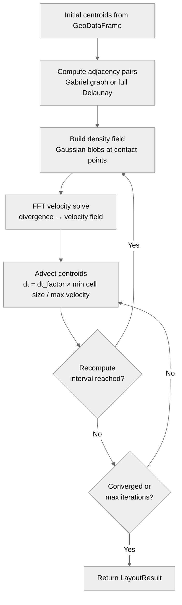

# Flow Density Layout Algorithm

## Overview

The flow density layout (`FlowDensityLayout`, string key `"flow_density"`) positions proportionally-sized circles by constructing a divergence field from per-pair Gaussian blobs placed at predicted contact points and advecting centroids through the resulting FFT-computed velocity field. Unlike force-based layouts, the field covers the full domain, so there is no background sink pulling circles into empty space — circles spread only in response to actual packing pressure.

Source: [layouts/flow/\_\_init\_\_.py](https://github.com/bright-fakl/carto-flow/blob/main/src/carto_flow/symbol_cartogram/layouts/flow/__init__.py) (`FlowDensityLayout`), [layouts/flow/\_simulator.py](https://github.com/bright-fakl/carto-flow/blob/main/src/carto_flow/symbol_cartogram/layouts/flow/_simulator.py) (`run_flow_density`)

## Algorithm Architecture

Each iteration rebuilds a density (divergence) field from the current centroid configuration, solves for the velocity field via FFT, and advects all centroids one step forward. The density field is rebuilt every `recompute_every` steps rather than every step, which keeps runtime manageable.



## Density Field Construction

For each adjacent pair $(i, j)$, the algorithm places one *split* anisotropic Gaussian blob centered at circle $i$'s **claim point** — the position that circle $i$'s boundary would occupy if the pair were exactly at their target separation.

**Claim distance for circle $i$:**

$$
c_i = d \cdot \frac{r_i + \sigma/2}{r_i + r_j + \sigma}
$$

where $d = \|\mathbf{p}_j - \mathbf{p}_i\|$ is the current center-to-center distance and $\sigma$ is the absolute spacing gap (`spacing × mean_radius`). The blob center is:

$$
\mathbf{p}^{\text{blob}} = \mathbf{p}_i + c_i \cdot \hat{\mathbf{u}}_{ij}
$$

**Anisotropic shape**: the blob is a split Gaussian with different parallel sigmas on each side. For the half facing circle $i$ (behind the claim point) the parallel sigma is $c_i$; for the half facing circle $j$ (ahead of the claim point) it is $c_j$. Both halves share the same perpendicular sigma:

$$
\sigma_\perp = \sigma_\perp^{\text{factor}} \cdot \max(c_i,\, c_j)
$$

At `sigma_perp_factor = 1.0` (default) the blob is nearly isotropic. Values less than 1 — typically 0.25–0.5 — make the blob narrower perpendicular to the pair axis, concentrating pressure along the line connecting the two centers and reducing cross-talk between nearby pairs. Values greater than 1 spread pressure broadly across the field.

**Sign convention**: blobs contribute a positive (diverging) density when circles overlap and a negative (converging) density when circles are too far apart. The net field acts as a pressure map: positive regions push circles apart, negative regions pull them together. The relative amplitude of push vs pull contributions is controlled by `force_balance`.

With optional `smooth > 0`, the raw density field is Gaussian-filtered before the velocity solve to reduce high-frequency noise.

## Velocity Solve

The velocity field is derived from the density field using the same FFT-based Poisson solver as the flow cartogram algorithm. This step converts the scalar divergence field into a 2D vector velocity field in $O(N^2 \log N)$ time where $N$ = `grid_size`.

## Advection and Convergence

Centroids are displaced along the velocity field with an adaptive timestep:

$$
\Delta t = \text{dt_factor} \cdot \frac{\min(\Delta x, \Delta y)}{v_{\max}}
$$

where $\Delta x, \Delta y$ are the grid cell sizes and $v_{\max}$ is the maximum velocity magnitude on the grid.

**Convergence metric**: mean relative nearest-neighbor spacing error across all circles. The error for circle $i$ is:

$$
e_i = \frac{\left|d_i^{\text{nn}} - (r_i + r_{\text{nn}(i)} + \sigma)\right|}{r_i + r_{\text{nn}(i)} + \sigma}
$$

where $d_i^{\text{nn}}$ is the distance to circle $i$'s nearest neighbor and $r_i + r_{\text{nn}(i)} + \sigma$ is the full target distance (including spacing). The algorithm stops when $\bar{e} < \text{convergence\_tolerance}$ (default 0.05) or `max_iterations` is reached.

## Adjacency Pairs

The density field is built only over pairs of circles that are considered neighbors. Two options are available via `use_gabriel`:

| Setting | Graph | Description |
|---------|-------|-------------|
| `True` (default) | Gabriel graph | Subset of Delaunay: edge $(i,j)$ is kept only if no other point lies inside the diametral circle of the edge |
| `False` | Full Delaunay | All Delaunay triangulation edges |

The Gabriel graph is sparser and avoids creating pressure between circles that are already separated by an intermediate circle, which typically produces cleaner results.

## Group-Aware Repulsion

When `group_by` or `tile_count` is used, the layout assigns a group id to each circle. Cross-group pull forces can be attenuated with `cross_group_pull_scale`:

| Value | Effect |
|-------|--------|
| `1.0` (default) | Cross-group pairs treated identically to within-group pairs |
| `0.0` | Cross-group pairs only repel (no attraction); groups separate without being attracted to each other |
| Intermediate | Partial attenuation of cross-group attraction |

This is useful when creating state-level cartograms where congressional districts (tiles) should cluster without being attracted to districts of neighboring states.

## Layout Selection Guide

`FlowDensityLayout` is a good default when you want proportional circles with good geographic preservation and no manual force-weight tuning. It tends to be more predictable than force-based layouts because the velocity field smoothly interpolates between push and pull.

## Parameter Reference

| Parameter | Default | Description |
|-----------|---------|-------------|
| `spacing` | 0.05 | Target gap between boundaries as fraction of mean radius |
| `sigma_perp_factor` | 1.0 | Perpendicular Gaussian width: `factor × max(claim_i, claim_j)`. At 1.0 the blob is nearly isotropic; values < 1 (typically 0.25–0.5) focus pressure along the pair axis |
| `smooth` | 0.0 | Gaussian filter sigma for density field in coordinate units. 0 = no smoothing |
| `damp` | `True` | Exponential dampening when circles are far from target; prevents excessive velocities |
| `use_gabriel` | `True` | Use Gabriel graph (sparser). `False` = full Delaunay |
| `max_iterations` | 500 | Maximum advection steps |
| `recompute_every` | 5 | Rebuild density and velocity fields every N steps |
| `dt_factor` | 0.3 | Timestep = factor × min(cell size) / max(velocity) |
| `convergence_tolerance` | 0.05 | Stop when mean relative NN spacing error < tolerance |
| `grid_size` | 256 | Grid resolution (square). Larger = more accurate, slower |
| `force_balance` | 1.0 | Push/pull weighting. Float > 0: push_scale = value; `"count"`: equal pair count; `"rms"`: equal field energy; `"repulse"`: push only |
| `cross_group_pull_scale` | 1.0 | Pull-force multiplier for cross-group pairs (0 = repulse-only across groups) |
| `save_density_fields` | `False` | Record rho, vx, vy at each recompute step (accessible via `history.algorithm.density_snapshots`) |

## Usage Example

```python
from carto_flow.symbol_cartogram import create_symbol_cartogram, FlowDensityLayout

# Basic usage — default options
result = create_symbol_cartogram(gdf, "population", layout=FlowDensityLayout())

# Grouped: congressional districts clustered by state with no cross-state attraction
result = create_symbol_cartogram(
    gdf,
    size="Population",
    group_by="STATE",
    layout=FlowDensityLayout(
        spacing=0.15,
        cross_group_pull_scale=0.0,  # states separate without attracting each other
        max_iterations=750,
    ),
)

# Using the string key shorthand
result = create_symbol_cartogram(gdf, "population", layout="flow_density")

result.plot(column="population", cmap="YlOrRd")
print(f"Converged: {result.layout_result.metrics.converged}")
print(f"Iterations: {result.layout_result.metrics.iterations}")
print(f"Mean NN error: {result.layout_result.metrics.algorithm.final_error:.3f}")
```
