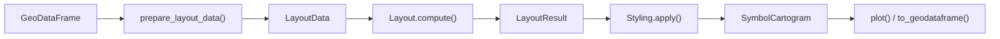

# Symbol Cartogram Pipeline

## Overview

A symbol cartogram replaces each polygon region with a proportionally-sized symbol — a circle, square, hexagon, or custom tile — whose area encodes a data value. Symbols are repositioned to avoid overlap while preserving the spatial arrangement and adjacency relationships of the original regions.

The pipeline has four stages: data preprocessing produces a `LayoutData` object from a GeoDataFrame; a layout algorithm computes symbol positions and stores them in an immutable `LayoutResult`; a `Styling` object maps symbol shape and transform decisions onto the layout; and the final `SymbolCartogram` contains the symbol geometries and quality metrics.

Source: [api.py](https://github.com/bright-fakl/carto-flow/blob/main/src/carto_flow/symbol_cartogram/api.py)



**Two API levels** are available. The all-in-one function `create_symbol_cartogram(gdf, size=..., ...)` runs the full pipeline in one call. The two-step API `create_layout(gdf, size=..., ...)` followed by `layout_result.style(...)` separates layout computation (expensive) from styling (fast), enabling multiple styling variations from a single computed layout.

---

## Data Preprocessing

Source: [layouts/data_prep.py](https://github.com/bright-fakl/carto-flow/blob/main/src/carto_flow/symbol_cartogram/layouts/data_prep.py)

`prepare_layout_data(gdf, size=None, *, tile_count=None, group_by=None, ...)` takes a GeoDataFrame
of polygon regions and returns a `LayoutData` dataclass. *N* denotes the total number of
items after any `tile_count` expansion; *G* denotes the number of input geometries.

```python
@dataclass
class LayoutData:
    positions: NDArray    # symbol centroids, shape (N, 2)
    sizes:     NDArray    # area-equivalent radii, shape (N,)
    adjacency: NDArray    # adjacency matrix, shape (N, N)
    bounds:    tuple      # geographic bounding box
    mean_area: float      # mean input geometry area
    source_gdf: gpd.GeoDataFrame
    valid_mask: NDArray | None         # bool mask identifying non-null rows in source_gdf
    geometry_positions: NDArray | None # G-level centroids before tile_count expansion, shape (G, 2)
    source_indices: NDArray | None     # maps each of the N items to its source row index (0..G-1)
    group_ids: NDArray | None          # integer group label per item, shape (N,)
    group_ids_G: NDArray | None        # user grouping per geometry, shape (G,); set only by group_by
```

### Symbol Sizes

`compute_symbol_sizes(values, scale, ...)` converts data values to area-equivalent radii (the radius such that circle area = π × radius² is proportional to the value). Three scaling modes:

| Mode | Relationship | Use case |
|------|-------------|----------|
| `"sqrt"` (default) | area ∝ value | Perceptually accurate for cartograms |
| `"linear"` | radius ∝ value | Visual size grows linearly |
| `"log"` | log(1 + value) | Compresses highly skewed distributions |

The `size_max_value` parameter fixes the reference maximum, enabling consistent size scaling across multiple cartograms of different datasets.

A zero data value is valid and gives a symbol of zero size. Every layout keeps
that symbol as a row of the result, aligned with the input GeoDataFrame, and
renders it as a zero-area geometry. A zero-size symbol has no extent, so it
cannot overlap a neighbour and cannot be pushed apart from one; quantities that
a layout measures in units of symbol size (a separation relative to the target
separation, a displacement relative to the symbol radius) are undefined for it
and are left out of the averages the layout reports.

When *every* value is zero there is no size scale at all. The force-based
layouts have nothing to place and leave every symbol at its geometry centroid;
the lattice layouts still assign tiles, using the mean geometry area as the
cell size in place of the largest symbol.

### Adjacency Matrix

`compute_adjacency(gdf, mode, distance_tolerance)` builds a symmetric or asymmetric matrix from polygon boundary relationships. A distance tolerance (default: 0.1% of the mean region diameter) handles small gaps common in real-world boundary data.

| Mode | Formula | Property |
|------|---------|---------|
| `"binary"` | 1 if shared boundary, else 0 | Symmetric |
| `"weighted"` | w[i,j] = shared\_length / perimeter[i] | Asymmetric |
| `"area_weighted"` | w[i,j] = area[j] / Σ neighbor\_areas[i] | Rows sum to 1 |

The adjacency matrix is used by layout algorithms to keep geographically adjacent symbols close together.

### Tile Count and Group By

Two mutually exclusive parameters alter how input rows are expanded into layout items:

**`tile_count`** (column name, integer values): each region *g* is expanded into
`tile_count[g]` separate items that will each be assigned to a distinct tile.
`LayoutData.source_indices` maps each item back to its origin row *g*.
`LayoutData.geometry_positions` holds the *G* original centroids before expansion
and is used to seed the initial tile assignment.

**`group_by`** (column name): attaches an integer `group_ids` label to each item
so that group-level styling overrides and `to_geodataframe(level="group")` can
aggregate symbols by group. It also sets `group_ids_G`, the same labels at
geometry level, for layouts that group geometries rather than symbols (mosaic).
Only layouts whose placement honours the grouping accept it: each layout class
declares this with the `supports_group_by` class attribute, and `create_layout`
raises `ValueError` for the others rather than silently placing symbols as if
no grouping had been given.
`tile_count` cannot be combined with `group_by`, so it leaves `group_ids_G` as
`None` and `group_ids` simply records which geometry each tile came from.
`None` means *each geometry is its own group* rather than *no grouping*: the
mosaic layout still requires each geometry's tiles to form one connected block.

`size` and `tile_count` address different questions: `size` controls *how large* each
symbol is; `tile_count` controls *how many* symbols represent each region.

---

## Layout System

Source: [layouts/](https://github.com/bright-fakl/carto-flow/blob/main/src/carto_flow/symbol_cartogram/layouts/), [layouts/layout_result.py](https://github.com/bright-fakl/carto-flow/blob/main/src/carto_flow/symbol_cartogram/layouts/layout_result.py)

### Layout ABC

`Layout` is an abstract base class with one method:

```python
class Layout(ABC):
    @abstractmethod
    def compute(self, data: LayoutData, ...) -> LayoutResult: ...
```

Four concrete implementations are registered under string keys and can be selected by name:

| String key | Class | Description |
|-----------|-------|-------------|
| `"topology"` | `CirclePackingLayout` | Two-stage physics with contact constraints; good topology preservation |
| `"physics"` | `CirclePhysicsLayout` | Velocity-based two-phase simulation; general purpose |
| `"flow_density"` | `FlowDensityLayout` | Gaussian density-field flow advection; covers full domain without background sink |
| `"grid"` | `GridBasedLayout` | Hungarian assignment to a regular tile grid |
| `"mosaic"` | `MosaicLayout` | Exact integer tile assignment with optional flow-morphing pre-step |
| `"centroid"` | `CentroidLayout` | Symbol at centroid; optional local overlap removal |

Algorithm details are in the [Grid Layout Algorithm](symbol-cartogram-grid-layout.md), [Circle Packing Layout Algorithm](symbol-cartogram-circle-packing.md), [Flow Density Layout Algorithm](symbol-cartogram-flow-density-layout.md), and [Mosaic Layout Algorithm](symbol-cartogram-mosaic-layout.md) explanations.

### LayoutResult

`LayoutResult` is an immutable dataclass produced by every layout algorithm:

```python
@dataclass
class LayoutResult:
    canonical_symbol: Symbol
    transforms:       list[Transform]   # one per region
    base_size:        float
    positions:        NDArray
    sizes:            NDArray
    adjacency:        NDArray
    bounds:           tuple
    crs:              str | None
    algorithm_info:   dict
    simulation_history: SimulationHistory | None
    metrics:          AlgorithmMetrics | None
```

`metrics` holds final scalar summaries common to all physics-based layouts (`converged`, `iterations`, `final_overlaps`) plus an algorithm-specific subobject (`PhysicsMetrics`, `PackingMetrics`, or `FlowDensityMetrics`). Convenience properties `result.converged`, `result.iterations`, and `result.overlaps` delegate to `metrics` and `simulation_history` respectively.

`simulation_history` holds per-iteration arrays. Its `algorithm` field is a typed subobject: `PhysicsHistory` (velocity per step), `PackingHistory` (drift, jitter, drift_rate), or `FlowDensityHistory` (mean and max NN errors).

Immutability ensures the computed positions are never modified after the layout runs, making it safe to apply multiple styling configurations to the same result.

`LayoutResult.serialize()` / `LayoutResult.from_serialized()` round-trip to JSON, allowing the expensive computation to be saved and reloaded.

### Transform

Each region's placement is captured in a frozen `Transform` dataclass:

```python
@dataclass(frozen=True)
class Transform:
    position:   tuple[float, float]   # symbol center (x, y)
    rotation:   float                  # radians
    scale:      float                  # multiplier relative to base_size
    reflection: bool                   # vertical axis flip
```

`transform.compose(other)` chains two transforms — used internally when the tiling geometry has its own rotation or reflection.

---

## Styling System

Source: [styling.py](https://github.com/bright-fakl/carto-flow/blob/main/src/carto_flow/symbol_cartogram/styling.py), [symbols.py](https://github.com/bright-fakl/carto-flow/blob/main/src/carto_flow/symbol_cartogram/symbols.py)

`Styling` collects symbol shape, transform overrides, and fit-mode decisions. `styling.apply(layout_result)` maps these decisions onto the transforms in a `LayoutResult` to produce a `SymbolCartogram`. The layout itself is not re-run.

### Symbols

`Symbol` is an abstract base class that defines a shape in the unit square [−0.5, 0.5]² via `unit_polygon()`. Concrete symbols:

| String alias | Class | Notes |
|-------------|-------|-------|
| `"circle"` | `CircleSymbol` | Inscribed radius = 0.5 |
| `"square"` | `SquareSymbol` | Axis-aligned |
| `"hexagon"` | `HexagonSymbol` | `pointy_top` parameter |
| `"triangle"` | `TriangleSymbol` | `pointing_up` parameter |
| `"diamond"` | `DiamondSymbol` | Square rotated 45° |
| `"pentagon"` | `PentagonSymbol` | `pointy_top` parameter |
| `"star"` | `StarSymbol` | `n_points`, `inner_radius_ratio` parameters |
| — | `IsohedralTileSymbol` | For tiling-based shapes |

Custom symbols subclass `Symbol` and implement `unit_polygon()`.

### Per-Geometry Overrides

`set_symbol()`, `transform()`, and `set_params()` each accept three targeting forms:

```python
# All regions
styling.set_symbol("hexagon")

# By index list
styling.set_symbol("square", indices=[0, 1, 2])

# By boolean mask
styling.set_symbol("circle", mask=(gdf["region"] == "West").values)

# Per-region positional array
styling.set_symbol(["circle", "hexagon", "square", ...])
```

The fluent API supports method chaining: `Styling().set_symbol("hexagon").transform(scale=0.9)`.

### Per-Group Overrides

When `group_by` was used at layout time, each item has a `group_ids` entry that `Styling`
can target with three group-level methods. Group overrides take precedence over the global
default but are overridden by per-geometry settings:

```python
styling = (
    Styling(symbol="hexagon")                          # global default
    .set_group_symbol("circle", group_indices=[0, 3])  # groups 0 and 3 use circles
    .group_transform(scale=0.7, group_indices=[1])     # group 1 scaled down
    .set_group_params({"pointy_top": False}, group_indices=[2])  # HexagonSymbol param
)
```

Resolution order: per-geometry > per-group > global > canonical symbol.

### FitMode

`FitMode` controls how the styled symbol is scaled into its canonical slot:

| Mode | Behavior |
|------|---------|
| `INSIDE` (default) | Symbol is guaranteed inside the tile boundary; centered |
| `AREA` | Symbol area equals tile area; may extend outside boundary |
| `FILL` | Maximizes symbol size while staying inside; center may shift (requires SciPy) |

---

## SymbolCartogram Result

Source: [result.py](https://github.com/bright-fakl/carto-flow/blob/main/src/carto_flow/symbol_cartogram/result.py)

`SymbolCartogram` is the final result object returned by the pipeline.

### Fields

- **`symbols`**: GeoDataFrame with one row per region. Internal columns: `_symbol_x`, `_symbol_y`, `_symbol_size`, `_displacement`, `original_index`.
- **`status`**: `CONVERGED` (convergence criterion met), `COMPLETED` (max iterations reached), or `ORIGINAL` (no layout run).
- **`metrics`**: dict with `displacement_mean`, `displacement_max`, `displacement_std`, `topology_preservation` (fraction of adjacencies preserved), `iterations`, `n_skipped`.
- **`simulation_history`**: optional `SimulationHistory` with per-iteration diagnostics (positions, overlaps, convergence metrics).
- **`layout_result`**: the `LayoutResult` from which this cartogram was produced.
- **`styling`**: the `Styling` configuration applied.

### Methods

**`restyle(styling=None, **kwargs)`** creates a new `SymbolCartogram` with different styling without re-running the layout. Requires `layout_result` to be present.

**`to_geodataframe(source_gdf=None, level="tile")`** exports the symbols as a GeoDataFrame.
`level="tile"` (default) returns one row per symbol tile.
`level="group"` requires `group_by` to have been set; returns one row per group with union geometry and a `tile_count` column.

**`get_displacement_vectors()`** returns an (n, 2) array of displacement vectors from original centroids to final symbol centers.

**`plot(...)`** plots the symbol cartogram with data-driven styling options. Covered in the [Style Symbol Cartograms](../how-to/style-symbols-by-category.ipynb) how-to.
