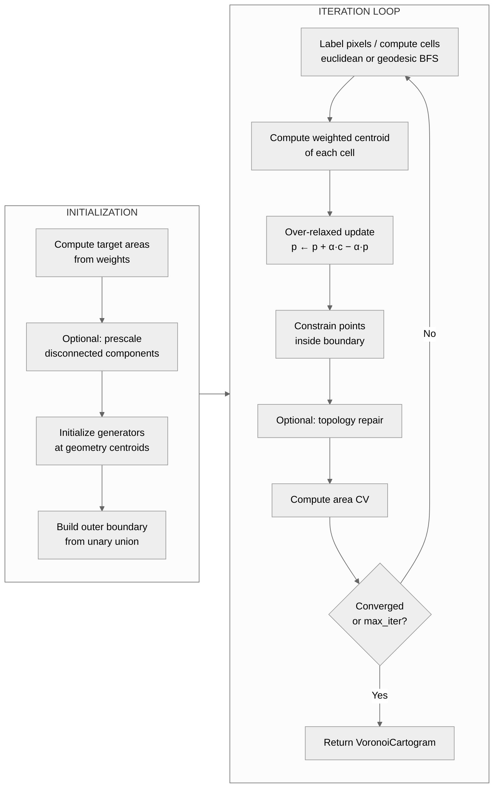

# Voronoi Cartogram Algorithm

## Overview

A Voronoi cartogram represents each region as a Voronoi cell whose area is
proportional to a data variable. Rather than deforming polygon boundaries
(as in flow cartograms), the algorithm moves a set of generator points —
initially placed at geometry centroids — until each point's cell has the
correct target area. Without weights the result approximates a **Centroidal
Voronoi Tessellation** (CVT): a tessellation of equal-area cells where every
generator is the centroid of its own cell. With weights the cells are
**power cells** (see [Weighted cells](#weighted-cells-power-diagrams)): convex
polygons with straight edges whose areas are proportional to the weights.

The implementation lives in
[`backends.py`](https://github.com/bright-fakl/carto-flow/blob/main/src/carto_flow/voronoi_cartogram/backends.py)
and the `fields/` package.
The entry point is `create_voronoi_cartogram()`
([`api.py`](https://github.com/bright-fakl/carto-flow/blob/main/src/carto_flow/voronoi_cartogram/api.py)).

## Mathematical Foundation

### CVT Condition

Given $G$ regions with weights $w_1, \ldots, w_G$ and a convex outer
boundary $\Omega$, a CVT satisfies:

$$
\mathbf{p}_i = \frac{\int_{V_i} \mathbf{x} \, \rho(\mathbf{x}) \, d\mathbf{x}}{\int_{V_i} \rho(\mathbf{x}) \, d\mathbf{x}}
$$

where $V_i$ is the Voronoi cell of generator $\mathbf{p}_i$ and $\rho$ is a
density field proportional to the target weights. For uniform density within
each cell this reduces to: each generator equals the area-weighted centroid
of its cell.

### Error Metric

During relaxation, convergence is tracked by the **area coefficient of
variation** (area CV) of the relaxation cells:

$$
\text{area\_cv} = \frac{\sigma(a_i / a_i^{\text{target}})}{\bar{a} / \bar{a}^{\text{target}}}
$$

where $a_i$ is the current cell area and $a_i^{\text{target}} \propto w_i$.
Lower is better; zero means perfect proportionality.

The output cells are judged by the **mean area error**
`metrics["mean_area_error_pct"]`, the mean of $|a_i / a_i^{\text{target}} - 1|$
over the final polygons (and `max_area_error_pct`, its maximum).

### Lloyd Relaxation Update

Each iteration applies one step of **Lloyd relaxation** with
successive over-relaxation (SOR):

$$
\mathbf{p}_i^{\text{new}} = \mathbf{p}_i + \alpha \left(\mathbf{c}_i - \mathbf{p}_i\right)
$$

where $\mathbf{c}_i$ is the weighted centroid of cell $V_i$ and $\alpha > 1$
is the over-relaxation factor (SOR accelerates convergence compared to
$\alpha = 1$).

---

## Computational Pipeline

### Initialization

1. Compute target areas: $a_i^{\text{target}} = w_i \cdot A_{\text{total}} / \sum w_j$, where $A_{\text{total}}$ is the area of the outer union boundary.
2. Optionally prescale disconnected components (see [Prescaling](#prescaling)).
3. Place one generator at each geometry's centroid (or representative point if the centroid falls outside the geometry).
4. Build the outer boundary polygon as `unary_union(geometries)`, optionally simplified by `options.simplify_tol`.

### Per-Iteration Steps

**Pixel labeling / cell computation** differs by backend (see [Backends](#the-two-backends)).

**Centroid**: For the raster backend, the centroid of cell $i$ is the mean
position of the pixels $k$ assigned to it:

$$
\mathbf{c}_i = \frac{1}{|V_i|} \sum_{k \in V_i} \mathbf{x}_k
$$

**Over-relaxed update**: $\mathbf{p}_i \leftarrow \mathbf{p}_i + \alpha(\mathbf{c}_i - \mathbf{p}_i)$.
With `RasterBackend(generator_anchor=a)` the target $\mathbf{c}_i$ is replaced by
$(1 - a)\,\mathbf{c}_i + a\,\mathbf{s}_i$, where $\mathbf{s}_i$ is the
generator's starting position (see [Flow Pre-morph and Generator Anchor](#flow-pre-morph-and-generator-anchor)).

**Boundary constraint**: any generator that drifts outside the outer boundary is hard-snapped back to the nearest boundary edge point.

---

## Weighted Cells: Power Diagrams

Plain Voronoi cells of centroidal generators have roughly equal areas, so
they cannot represent weights by themselves. With weights, `RasterBackend`
(euclidean distance) assigns each point $\mathbf{x}$ to the generator that
minimizes the **power distance**

$$
|\mathbf{x} - \mathbf{p}_i|^2 - \lambda_i,
$$

with one offset $\lambda_i$ per generator. The border between two cells is the
straight line where both power distances are equal, so every cell is the
intersection of half-planes: a convex polygon (before clipping to the outer
boundary) that shares its edges exactly with its neighbors. Raising
$\lambda_i$ grows cell $i$.

**During relaxation** the offsets are adapted on the raster: each iteration
moves $\lambda_i$ by `area_equalizer_rate` $\cdot\, 2 (a_i^{\text{target}} - a_i)$,
so the offsets accumulate each cell's area deficit, and the generators move to
the centroids of their power cells. While the generators are still far from
their centroids the offsets also decay slightly each iteration; this damps the
interplay between offset and generator updates, which otherwise oscillates when
many generators start clustered. The target areas are ramped from equal to
weight-proportional over `weight_ramp_iters` iterations.

**Final cells** are computed exactly. For fixed generators, offsets that give
every cell its target area exist and are unique up to a common constant; they
maximize a concave function whose gradient is the area deficit and whose
Hessian has the entries

$$
\frac{\partial a_i}{\partial \lambda_j} = -\frac{L_{ij}}{2\,|\mathbf{p}_i - \mathbf{p}_j|}, \qquad
\frac{\partial a_i}{\partial \lambda_i} = \sum_{j \ne i} \frac{L_{ij}}{2\,|\mathbf{p}_i - \mathbf{p}_j|},
$$

where $L_{ij}$ is the length of the shared edge inside the boundary. Starting
from the relaxation's offsets, a damped Newton method on the exact clipped
polygon areas solves for these offsets until every cell is within
`VoronoiOptions.area_error_tol` (default 1 %) of its target, usually in two to
five steps. The power diagram itself comes from the lower convex hull of the
lifted points $(\mathbf{p}_i, |\mathbf{p}_i|^2 - \lambda_i)$. The targets are
weight-proportional shares of the final boundary area, which an
`ElasticBoundary` may have changed.

The run reports `converged=False`, with a warning that states the mean and
maximum errors, whenever the mean area error of a weighted result exceeds
`area_error_tol`.

**Limits.** The Newton step keeps the generators fixed, so it fixes the areas
but not the shapes: when the relaxation has not settled (too few iterations, or
target cells only a few pixels large at the chosen `resolution`), some
generators end up far from the centroid of their cell, and small cells can
become thin slivers. A convex cell clipped to a non-convex boundary can also
split into several parts across a bay or lake. `ExactBackend` and
`distance_mode="geodesic"` ignore weights.

---

## The Two Backends

### RasterBackend (default)

Labels a raster grid of `resolution × resolution` pixels by the nearest
generator. The weighted centroid of each label region is then computed as
a pixel average.

**Speed**: 10–50× faster than the exact backend because centroid computation reduces to array indexing (no geometric intersection).

Key parameters:

| Parameter | Default | Description |
|---|---|---|
| `resolution` | 300 | Pixel grid size (longer axis) |
| `relaxation` | `"overrelax"` | SOR factor schedule |
| `distance_mode` | `"euclidean"` | `"euclidean"` or `"geodesic"` (see [Geodesic Labeling](voronoi-cartogram-geodesic-labeling.md)) |
| `area_equalizer_rate` | 0.1 | Power-diagram offset learning rate |
| `boundary` | `None` | `AdhesiveBoundary` or `ElasticBoundary` |
| `adjacency_spring` | 0.0 | Spring strength preserving adjacency |
| `generator_anchor` | `None` | Pull of the generators toward their starting positions; `None` = 0.5 with `premorph`, else 0 |

**Pure FFT-flow mode**: pass `relaxation=0.0` together with `ElasticBoundary` to skip Lloyd relaxation entirely and drive movement solely from area-pressure via the FFT velocity field.

### ExactBackend

Computes `scipy.spatial.Voronoi` on the generator points augmented with
mirror points at the boundary, then clips each infinite/bounded cell to the
outer boundary using shapely intersection.

**Accuracy**: geometrically exact cells. Useful for small datasets or when
precise cell shapes matter for downstream analysis.

**Limitation**: does not support `ElasticBoundary` (only `AdhesiveBoundary`).

---

## Relaxation Schedule

The over-relaxation factor $\alpha$ controls step size. A value $\alpha > 1$
(SOR) converges faster than plain Lloyd ($\alpha = 1$) but can overshoot if
too large.

`RelaxationSchedule(start, decay, minimum)` decays the factor geometrically:

$$
\alpha_i = \max(\text{minimum},\ \text{start} \times \text{decay}^i)
$$

The shorthand `"overrelax"` resolves to `RelaxationSchedule(start=1.9, decay=0.98, minimum=1.0)`. Passing a plain float (e.g. `relaxation=1.5`) uses a constant factor. A callable `f(iteration) -> float` allows arbitrary schedules.

---

## Convergence Criteria

The algorithm stops at the first satisfied condition:

| Criterion | Parameter | Description |
|---|---|---|
| Area CV tolerance | `area_cv_tol` | Stop when `area_cv < area_cv_tol` |
| Displacement tolerance | `tol` | Stop when max centroid displacement per iter < `tol` (in CRS units) |
| Iteration limit | `n_iter` | Hard stop after `n_iter` iterations (default 30) |

`metrics["converged"]` is `True` when `area_cv_tol` or `tol` stopped the run.
For weighted runs it is additionally `False` when the mean area error of the
output cells exceeds `area_error_tol`.

---

## Prescaling

When `VoronoiOptions(prescale_components=True)`, each group of geometrically
connected polygons is uniformly scaled to its collective target area **before**
the Lloyd iteration starts. This is the same routine used by the flow cartogram
(`prescale_connected_components()` from
[`geo_utils/prescale.py`](https://github.com/bright-fakl/carto-flow/blob/main/src/carto_flow/geo_utils/prescale.py)).

Prescaling reduces initial area CV, allowing faster convergence with fewer
iterations. It is particularly effective when some regions are far from their
target areas at the start.

---

## Boundary Behavior

By default the outer boundary is **fixed**: generators are constrained inside
it and the boundary polygon does not change.

**`AdhesiveBoundary(strength)`**: generators whose geometry touches the outer
boundary are attracted toward the boundary edge (snapped by `strength ∈ [0,1]`
toward the nearest boundary point). Available on both backends.

**`ElasticBoundary(strength, step_scale, density_smooth, min_boundary_points, adhesion_strength)`**: the boundary
vertices themselves are advected by an FFT-derived velocity field proportional
to the area pressure at each cell. The outer hull flexes to accommodate large
area changes at the periphery. Available on `RasterBackend` only.
Without weights the pressure comes from the plain Voronoi cell areas. With
weights it comes from the input density: every pixel of the initial boundary
carries the density of the input region it lies in (weight divided by region
area), and these values move with the same flow as the boundary. The boundary
therefore moves outward next to regions whose weight share exceeds their area
share (for population, the dense northeastern states) and inward next to
sparse ones, until the carried density evens out. Inside the boundary the
carried density is scaled to hold the total weight, and outside it keeps the
initial mean, so the boundary changes shape but keeps its initial area. The
cells inside still match the weights exactly.
`min_boundary_points` densifies simple shapes (e.g. `"bbox"`) for smoother
deformation; `adhesion_strength` combines elastic deformation with centroid
adhesion in a single pass (equivalent to `AdhesiveBoundary` but with the snap
target tracking the evolving boundary shape).

---

## Flow Pre-morph and Generator Anchor

`create_voronoi_cartogram(..., premorph=True)` first morphs the regions with
the flow cartogram (`carto_flow.flow_cartogram.morph_gdf`) by the same weights,
then runs the Voronoi relaxation on the morphed regions: the generators start
at the morphed centroids, and the boundary (`"union"` by default) is the union
of the morphed regions. The flow cartogram has already given each region about
its target area, so the outline and the arrangement of the regions are those of
a density-equalizing map, and the relaxation only has to make the cells convex
and their areas exact; it usually needs far fewer iterations than on the
original outline. Without weights the morph equalizes the region areas. A
`MorphOptions` can be passed instead of `True`. Morphed rings that are not
valid polygons are repaired with `make_valid`, keeping only the polygonal
parts. The boundary stays rigid unless the backend has an `ElasticBoundary`.

**Why an anchor.** Plain Lloyd relaxation moves every generator to the centroid
of its cell, which makes cells compact but does not keep them where they
started. A power cell is convex, so a large cell cannot cover a concave region
or a narrow part of the outline; a neighboring generator then owns that part,
moves toward its centroid and takes it over. In the US population cartogram,
Texas' morphed region reaches south along the Gulf coast to the Mexican border.
In the first iterations the offsets have not grown yet, so Texas' cell is far
smaller than its target while Louisiana's is larger than its own and includes
south Texas, and the over-relaxed steps carry Louisiana's generator into south
Texas. Once the offsets have caught up, the cells form a centroidal power
diagram and stay that way: Louisiana's cell sits on the Texas coast.

**Anchor.** With `RasterBackend(generator_anchor=a)`, $a \in [0, 1]$, each step
moves a generator toward $(1 - a)\,\mathbf{c}_i + a\,\mathbf{s}_i$, so the
generators settle between the centroids of their cells and their starting
positions. The power offsets still give every cell its target area, because a
power diagram can realize any target areas for any generator positions; the
anchor only trades cell compactness for staying close to the starting layout.
`a = 0` is plain Lloyd relaxation, `a = 1` keeps the generators at their
starting positions. With `premorph`, `generator_anchor=None` (the default)
uses `a = 0.5`; otherwise it uses 0, the plain relaxation. With an
`ElasticBoundary` the starting positions are moved with the boundary flow.

The anchor keeps regions near their morphed locations at the cost of less
compact cells, with generators further from their cell centroids. On the
original, fixed outline the cells have to move far from the original centroids
to reach their areas, and an anchor there makes cells less compact without
keeping regions closer to their original locations.

---

## Limitations

**Fixed topology order.** Voronoi cells are assigned to generators by position;
if two generators cross, their cell assignments may swap unexpectedly. Use
`TopologyRepair` or `repair_topology()` to detect and fix this (see
[Contiguity Repair](voronoi-cartogram-contiguity.md)).

**Boundary artifacts.** The outer boundary is treated as hard walls. Peripheral
generators may cluster near the boundary if their target area is large compared
to available boundary-adjacent space. `ElasticBoundary` mitigates this.

**Resolution trade-off (RasterBackend).** Higher `resolution` gives smoother
cell boundaries and more accurate centroids but increases memory and compute
time quadratically. Values of 300–512 are typical.
